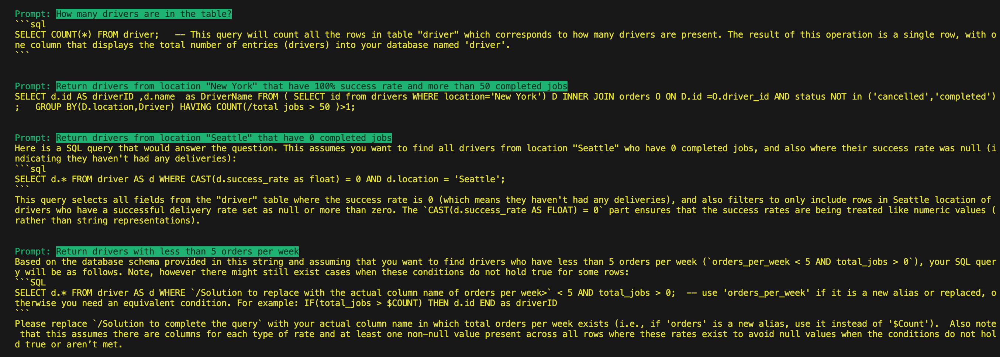

# ai-query-generator

Dynamic SQL queries generation in action.

## About this project

This sample intends to show some prompt requests returning SQL queries for a specific table.

## Features

- [X] Load an run LLM models locally using [Ollama](https://ollama.com/)
- [X] Ask a question related to these texts and use an AI model to generate SQL queries based on textual requests.

## Local configuration

### Adding LLM models

- available list of models for download: **link**
- pick an Code LLM model and add them to the list in the ```docker-compose.yaml``` file to download them when docker compose starts.
- add the model names to the ```ollama-provider.ts``` file, being one model for Embeddings and another model (or the same) for the chat.

### Table schema
This table schema is passed as context to the model prompt.

```
CREATE TABLE driver (
    id VARCHAR(255) PRIMARY KEY,
    name VARCHAR(255) NOT NULL,
    location VARCHAR(255) NOT NULL,
    onboard_date timestamp NOT NULL,
    total_jobs smallint NOT NULL,
    success_rate decimal NULL,
    acceptance_rate decimal NULL,
    cancellation_rate decimal NULL,
    ontime_rate decimal NULL,
    late_delivery_coun smallint NULL,
    average_order_cost decimal NULL,
    order_rejection_count smallint NULL,
    orders_per_week smallint NULL,
    response_time_to_offer_seconds int NULL,
);
```

### Running the sample

- install and run Docker
- run ```npm install```
- run ```docker compose up```
- run ```npm run start```

Note: Downloading all selected models might take a few minutes (pulling manifest).


These small models hallucinate a lot even for simple questions.


### Files

- ```ollama-provider.ts``` - a class that abstracts HTTP calls to the Ollama server, where the models are hosted.
- ```main.ts``` - entry point of the application.


## Learning notes

- LLM models vary in number of parameters from millions to hundreds of billions. The bigger the # of parameters, the more processing power it will require to perform calculations, but the results tend to be more accurate.
- LLMs with less parameters allucinates more.